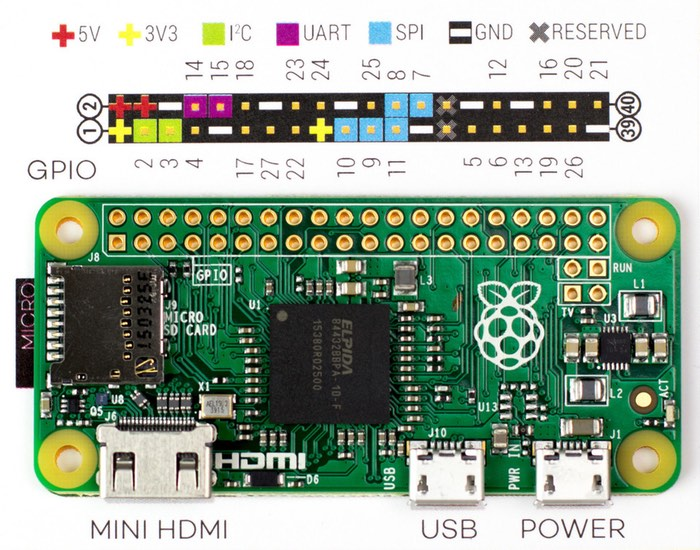
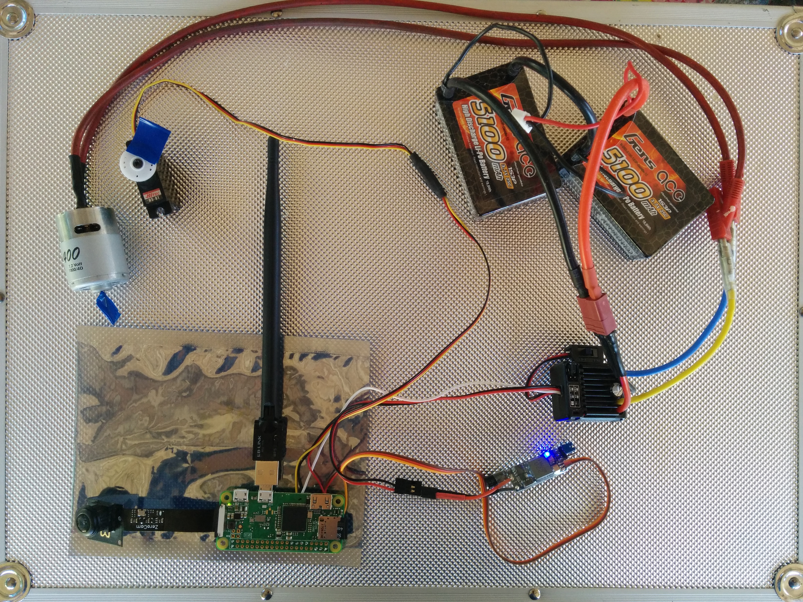
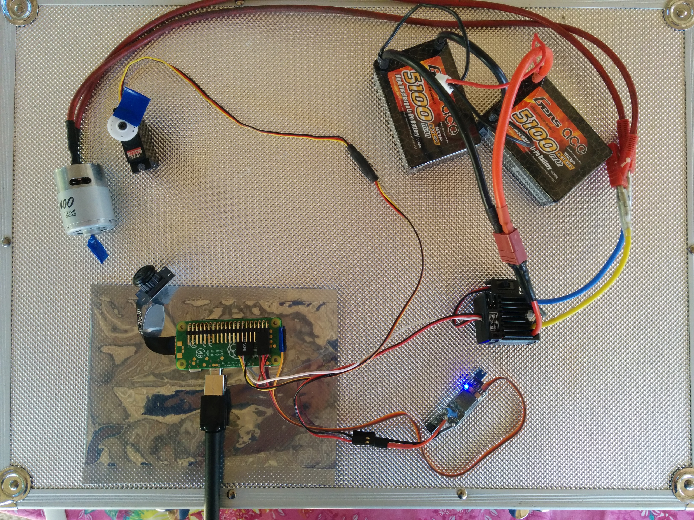
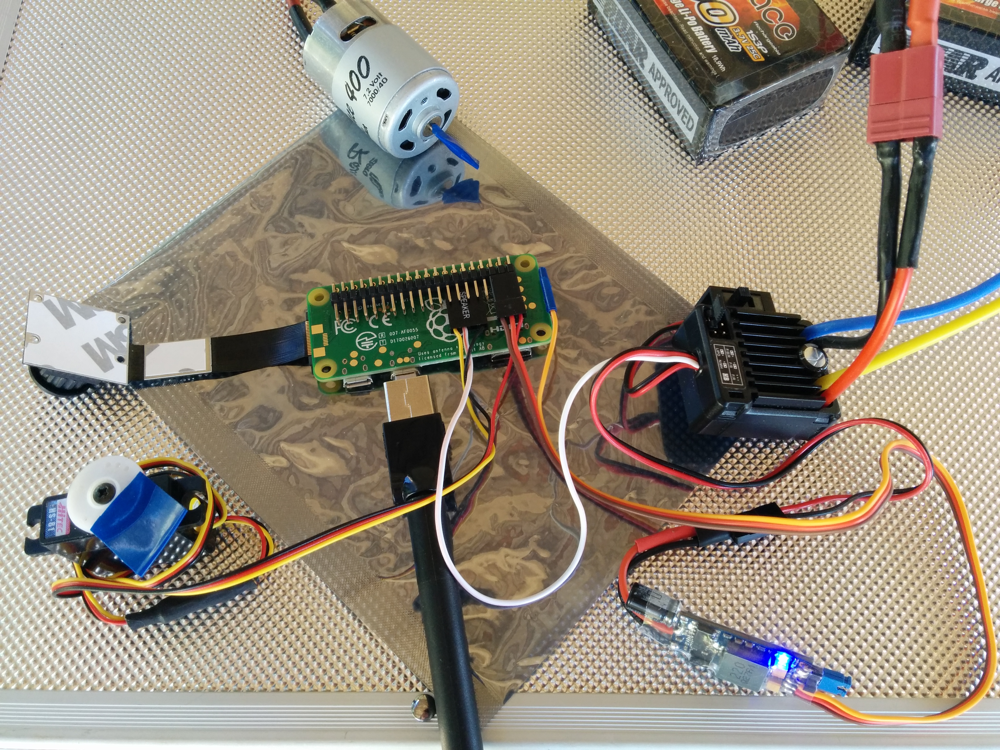
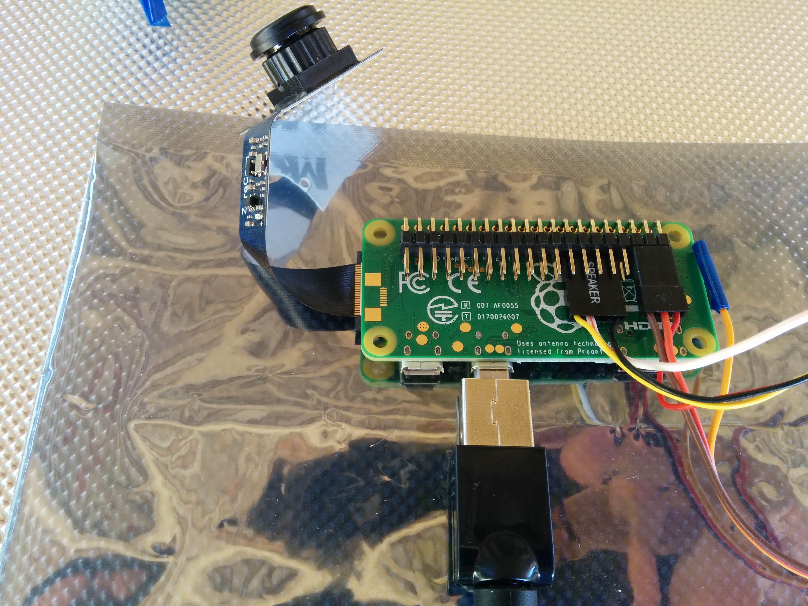

# TD;LR

Replace a standard remote control for RC Boat by:

  * webpage with RC controls (forward, bacward, left, right) and video streaming 
  * accessible through a dedicated Wifi hotspot (access on phone/tablet/PC)
  * Raspberry Pi web server, controlling onboard GPIO/Servo/Motor & Camera
  * onboard video streaming is accessible for anybody connected to open PiBoat wifi


This guide was written for beginers (in Raspberry, GPIO, Servo, ...), with sometimes detailed instructions.
Expect about $50 cost and ~10 hours to install & configure it.


# Onboard Raspberry Pi

1. Get/Buy Raspberry Pi hardware
    * Pi Zero W
    * Pi Zero Camera (any model, I prefered a fisheye)
    * Wifi dongle with long-range antenna (compatible with Pi)
    * 4GB micro-SD card (with some USB device to plug on your desktop PC for configuration)
    * soldering stuff, plugs, ...
    * during installation phase, you will also need: 
        * micro-USB power cable for Pi Zero
        * USB keyboard
        * mini-HDMI output 


2. Install Raspberry basic software

    The basic OS is just a raspbian-lite. So just follow standard Raspbian instructions here: https://www.raspberrypi.org/documentation/installation/installing-images/README.md
    using Raspbian-Lite image (https://downloads.raspberrypi.org/raspbian_lite_latest) and Etcher tool (https://etcher.io/).

    In the end, you should have a functionnal SD-card with Raspbian-Lite installed on it.


3. Configure Raspberry software
    1. Plug cables:
        * plug HDMI cable on Pi Zero and external TV/screen/...
        * plug keyboard on Pi Zero micro-USB port (through USB <-> micro-USB converter, closest to center of the board)
        * plug SD-card in its Pi Zero slot
        * plug micro-USB power cable on Pi Zero (plugged on connector farest to center of board)
        Now, Pi Zero will startup and display its initialization info on your TV/screen.
    2. Configure OS: user, network & remote access
        1. login at prompt: login=pi password=raspberry
        2. change user password using `raspi-config` menu
        3. [change locale] using `raspi-config` menu
        4. add SSH server at startup: `sudo systemctl enable ssh`
        5. setup wifi to connect on your home network, for instance fill with your wifi network PSK: `sudo vi /etc/network/interfaces`
        ```
        ...
        auto wlan0
        allow-hotplug wlan0
        iface wlan0 inet dhcp
        wpa-ssid "myssid"
        wpa-psk "mypsk"
        ```
        6. check wifi access: `sudo service networking restart` and get the wifi IP: `ifconfig wlan0` (usually 192.168.1.xxx)
        
        Now we will reboot to control the raspberry only with command line through SSH (you can use PuTTY client from your Windows computer): `sudo halt`, wait shutdown and then unplug HDMI, USB keyboard, micro-USB power supply. Then replug micro-USB power supply and camera only.
    3. Install & configure web server
        1. login through SSH to your Pi Zero using PuTTY or any SSH client: `ssh pi@192.168.1.xxx`
        2. install NodeJS web server : `sudo apt-get install nodejs npm`
        3. install PiBoat web app: `sudo apt-get install git; git clone https://github.com/yannrichet/PiBoat.git`, and dependencies: `npm install express http ip pi-blaster.js`
        4. install Pi GPIO (pi-blaster.js) control lib: `git clone https://github.com/sarfata/pi-blaster.git; sudo apt-get install autoconf; cd pi-blaster; ./autogen.sh; ./configure; make`
       Ref: https://github.com/sarfata/pi-blaster
        5. install UV4L streaming service: `sudo echo "deb http://www.linux-projects.org/listing/uv4l_repo/raspbian/ jessie main" >> /etc/apt/source.list; sudo apt-get install uv4l uv4l-raspicam uv4l-raspicam-extras uv4l-server uv4l-uvc uv4l-xscreen uv4l-mjpegstream uv4l-dummy uv4l-raspidisp`
        Ref: https://www.linux-projects.org/uv4l/installation/
        6. setup UV4L: `sudo vi /etc/uv4l/uv4l-raspicam.conf`, and set display size: `width = 320`, `height = 240`, then add to startup: `sudo systemctl enable uv4l_raspicam`
        7. add PiBoat & pi-blaster at startup: `sudo ln -s /home/pi/PiBoat/PiBoat.daemon.sh /etc/init.d/PiBoat; sudo systemctl enable PiBoat`
        
        Now you can restart your Pi Zero: `sudo reboot` and then connect to web app through any web browser (on phone, tablet or PC) using http://192.168.1.xxx
    4. Install and configure dedicated long-range wifi network
 
        Ref: https://frillip.com/using-your-raspberry-pi-3-as-a-wifi-access-point-with-hostapd/
        1. identify your wifi antenna: `lsusb`
        2. install Access Point softwares: `sudo apt-get install hostapd dnsmasq` and then
        
             (*) if using RealTek chip for your antenna, you will have problems with default hostap. Some turn-around is here: https://github.com/lostincynicism/hostapd-rtl8188 
             * configure network: `sudo vi /etc/network/interfaces`
             ```
        ...
        auto wlan1
        allow-hotplug wlan1
        iface wlan1 inet static
            address 192.168.2.1
            netmask 255.255.255.0
            network 192.168.2.0
            broadcast 192.168.2.255
            hostapd /etc/hostapd/hostapd.conf
            wireless-power off
            ```
            * configure access point: `sudo vi /etc/hostapd/hostapd.conf`
            ```
            interface=wlan1
            ssid=PiBoat
            channel=1
            macaddr_acl=0
            auth_algs=1
            ignore_broadcast_ssid=0
            driver=rtl871xdrv # TO BE CHANGED IF NEEDED
            ieee80211n=1
            hw_mode=g
            device_name=RTL8192CU
            manufacturer=Realtek
            ```
            * configure dns/dhcp: `sudo vi /etc/dnsmasq.conf`
            ```
            interface=wlan1
            listen-address=192.168.2.1
            bind-interfaces
            server=192.168.2.1
            domain-needed
            bogus-priv
            dhcp-range=192.168.2.10,192.168.2.20,12h 
            ```

      Now you can stop your Pi Zero for next hardware step: soldering of servo & motor control...


# Onboard Servo & Motor control

This is the hard part. 

I choose to plug pins 22 and 27 from Pi Zero, and to power the Pi Zero from the output of the boat ESC (2 pins +5V and groun pin on row 2):



So, I had to add another small UBEC to power Pi Zero (see blue light), because my ESC secondary output was 6V...

Whole result:

<table><tr><td>

</td><td>

</td></tr></table>

In action:


Details of the Pi Zero pins:

<table><tr><td>

</td><td>

</td></tr></table>


Before powering the ESC, I __strongly__ suggest that you check all the cables that connect every part. If you make some mistake (like I did :), you will burn your Pi Zero or servo.


# Use it

  * Just plug the boat battery on the ESC
  * Turn the ESC on, so it powers the Pi Zero
  * Wait about 1 minute that the Pi Zero starts its web app and wifi hotspot
  * Connect your phone to "PiBoat" wifi hotspot
  * Open http://192.168.2.1 in your phone browser
  * Control it using left/right/top/bottom buttons and see onboard view in real-time (expect less than .5 seconds delay)


